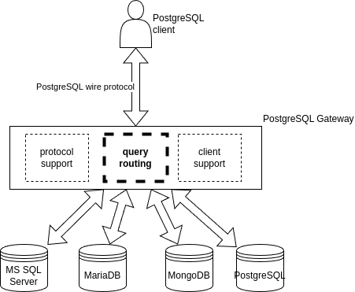
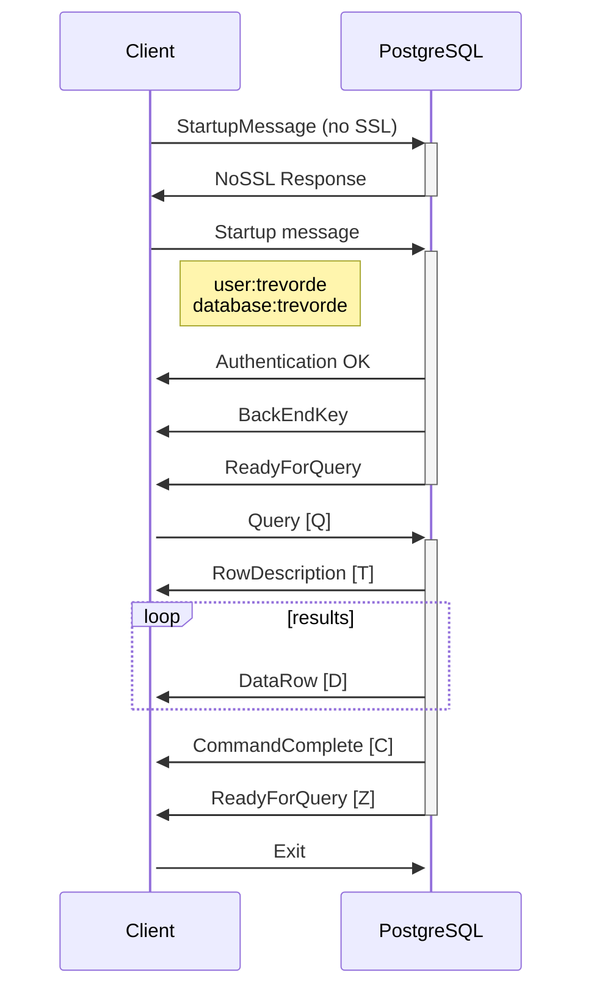
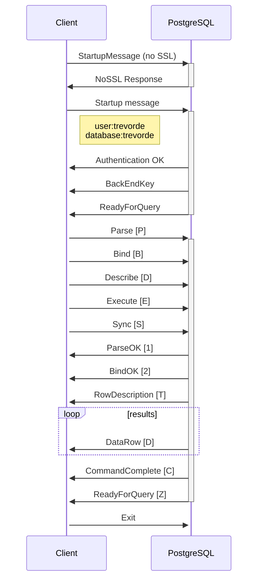

# PostgreSQL Gateway
A server running PostgreSQL protocol so you can route queries through to
other data sources

## Architecture


<details>

### Protocol support

* mostly to de/serialise PostgreSQL wire protocol messages
* manage TCP sockets
* manage SSL negotiation

### Query routing

Takes a query, examines it, passes it to an suitable datasource, and returns the results.

There may be multiple query handlers and each will be called in a specified order to see
if it can handle the query. Processing stops once the first query handler has handled the
query.

This is the most important extension point.  Custom query handlers may be written to retrieve
data from any arbitrary datasource, even key-value and non-relational databases.
Typically, a custom query handler might search the query for an embedded GUID corresponding
to its datasource. Further, the query does not even have to be SQL as the raw query is
passed directly to the custom query handler.

### Client support

* sends back hard coded responses which are expected by various clients
* typically queries about PostgreSQL server metadata eg
  * `server_version`
  * list of databases
  * list of datatyes

</details>

## Prerequisites

<details>

### Mandatory

* .NET 9 SDK
* git
* [psql client](https://www.postgresguide.com/utilities/psql/)

  ```bash
  sudo apt-get update
  sudo apt-get install postgresql-client
  ```

### Recommended

* [DBeaver](https://dbeaver.io/)
* Postgres
  ```bash
  docker pull postgres
  docker run --name postgres -e POSTGRES_PASSWORD=mysecretpassword -p 5432:5432 -d postgres
  ```

</details>


## Getting started

<details>

```bash
git clone https://github.com/TrevorDArcyEvans/PostgreSQLGateway.git
cd PostgreSQLGateway
dotnet build
dotnet run

info: PostgreSQLGateway.Program[0]
      Starting server - ctrl-c to stop...
info: PostgreSQLGateway.Program[0]
      Listening for connections on port 5432...
info: PostgreSQLGateway.Program[0]
      Connection accepted from 127.0.0.1:45936.
info: PostgreSQLGateway.Program[0]
      Received data from client:?/
info: PostgreSQLGateway.Program[0]
      Received data from client: Tusertrevordedatabasetrevordeapplication_namepsqlclient_encodingUTF8
info: PostgreSQLGateway.Program[0]
      Received data from client: Qselect 1;
info: PostgreSQLGateway.Program[0]
      Received data from client: X
info: PostgreSQLGateway.Program[0]
      Shutting down...
```

In second terminal:

```
 psql --host=localhost -c "SELECT 1;" -e -E
select 1;
 Id |          Name          
----+------------------------
 21 | Mr Jacob Rees-Mogg Esq
 23 | Rishi Sunak
(2 rows)
```

</details>


## Protocols

### Simple

<details>



</details>

### Extended

<details>



</details>


## Further work

<details>

* support front end messages
  * SSL request
  * GSS API encryption request
* support SSL
  * https://learn.microsoft.com/en-us/dotnet/api/system.net.security.sslstream?view=net-9.0&redirectedfrom=MSDN 
* support various front ends
  * [psql](https://www.postgresguide.com/utilities/psql/)
  * [Npgsql](https://www.npgsql.org/)
  * [DBeaver](https://dbeaver.io/)
* support PostgreSQL protocols
  * simple
  * extended
* multi-threaded server
* routing of queries
  * probably via plugins aka extension point/s

</details>


## Further information

<details>

* [PostgreSQL wire protocol](https://www.postgresql.org/docs/current/protocol.html)
* [PSQL wire protocol in go](https://github.com/jeroenrinzema/psql-wire)
* [Building a PostgreSQL Wire Protocol Server using Vanilla, Modern Java 21](https://gavinray97.github.io/blog/postgres-wire-protocol-jdk-21)
* [Demo implementations of the Postgres Wire Protocol](https://github.com/rgwood/odbc/tree/main)
* [Postgres on the wire - A look at the PostgreSQL wire protocol](https://beta.pgcon.org/2014/schedule/attachments/330_postgres-for-the-wire.pdf)
  * [local copy (pdf)](docs/330_postgres-for-the-wire.pdf)
* [PostgresMessageSerializer](https://github.com/kbth/PostgresMessageSerializer/tree/master)
* [pgres serve](https://github.com/ewinnington/pgresserve)
* [PostgreSQL System Catalogs](https://www.postgresql.org/docs/current/catalogs.html)
* [Slon - A modern high performance PostgreSQL protocol implementation for .NET](https://github.com/NinoFloris/Slon)
* [RaveDB PostgreSQL integration](https://github.com/ravendb/ravendb/tree/v5.4/src/Raven.Server/Integrations/PostgreSQL)
  * [Integrations - Would like PostgreSQL integration to support DBeaver](https://github.com/ravendb/ravendb/issues/17037)
  * [GNU Affero General Public License](https://www.gnu.org/licenses/agpl-3.0.en.html)
  * [GNU Affero General Public License on Wikipedia](https://en.wikipedia.org/wiki/GNU_Affero_General_Public_License)
  * [What is the AGPL license? Top questions answered](https://snyk.io/learn/agpl-license/)
  * [Open Source Software Licenses 101: The AGPL License](https://fossa.com/blog/open-source-software-licenses-101-agpl-license/)
* [ClickHouse PostgreSQL driver (C++)](https://github.com/ClickHouse/ClickHouse/tree/master/src/Databases/PostgreSQL)

</details>
